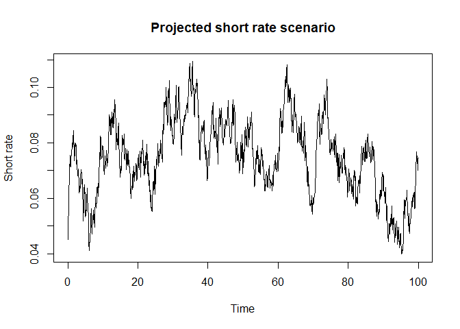
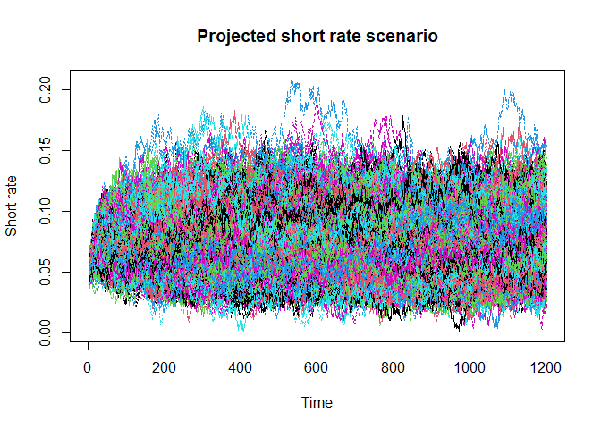

<!-- README.md is generated from README.Rmd. Please edit that file -->

# simpleLocalESG

<!-- badges: start -->
<!-- badges: end -->

The goal of simpleLocalESG is to allow users to develop and assess
statistical models for generating economic scenarios. The package was
initiated to provide a baseline for research students to beat at the
MAC-MIGS Data camp run in April 2024.

## Installation

You can install the development version of `simpleLocalESG` by cloning
this repository, opening the project on your local machine and running
the following line of code

``` r
devtools::install()
```

``` r
library(simpleLocalESG)
```

## Using the scenario generator

Suppose we are interested in projecting nominal interest rates into the
future. Let’s assume that the nominal risk-free short rate process can
be modelled as $$
n (t) = \phi (t) = x_1 (t) + x_2 (t), n (0) = n_0,
$$ where $\phi (t)$ is a deterministic, time-dependent shift function
that allows our model to fit the observed term structure for nominal
rates in the market, and $\left\{ x_i (t), i = 1, 2 : t \geq 0 \right\}$
are correlated Cox-Ingersoll-Ross (CIR) processes.

### The CIR process

Under the risk-neutral measure $Q$, the CIR processes are defined by the
stochastic differential equation $$
d x_i (t) = \alpha_i (\mu_i - x_i (t)) dt + \sigma_i \sqrt{x_i (t)} dZ_i^Q (t), \; 
x_i (0) = x_{i, 0}, \;
i = 1, 2,
$$ where $\left\{ Z_i^Q (t) \right\}_{i = 1, 2}$ are Weiner processes
under $Q$ with instantaneous correlation $\rho$ such that $$
d \langle Z_1^Q (t), Z_2^Q (t) \rangle = \rho dt, \; -1 \leq \rho \leq 1.
$$

### Simulating stochastic processes

There are many ways that we may choose to simulate stochastic processes
such as the CIR process presented above. Here, we look to separate the
random number generation which drives stochastic variation from the
deterministic mapping of these variables that imposes the desired
statistical properties on the variables.

This algorithm can be thought of as proceeding in 3 steps. First, we
generate the iid normal random variables
$X \sim \mathcal N (0, \mathbf I)$. We then apply the mapping
$f : X \to dZ^Q$ such that $\dZ^Q \sim \mathcal N (0, \Sigma \, dt)$
where $$
\Sigma = 
\begin{bmatrix}
1 & \rho \\
\rho & 1
\end{bmatrix}.
$$ Finally, we use the sample from $dZ^Q$ to construct a CIR process.

We can implement this algorithm given $$
dZ^Q \sim f (X) = \sqrt{dt} L X,
$$ where $L^T L = \Sigma$.

Let’s write some code to implement this algorithm. We first specify the
number of years we wish to simulate and the time step we wish to take.
Here, we will simulate a short rate over 100 years at monthly time
steps.

``` r
nYears <- 100
dt <- 1 / 12
```

We generate all the random variables required to drive variation in the
trial.

``` r
nFactors <- 2

X <- rnorm(nFactors * nYears / dt) %>% 
  matrix(nrow = 2)
```

We then use these standard normal random variables to construct the
correlated Weiner process.

``` r
rho <- - 0.739
weinerSigma <- matrix(c(1, rho, rho, 1), nrow = 2)
weinerL <- t(chol(weinerSigma))

dZ <- correlateWeinerProcess(
  X, weinerL, dt
)
```

Given parameter values for each of the CIR factors in the model for the
nominal short rates, we are now ready to generate the CIR factors
driving variation in the short rate.

``` r
# Initial values
x_10 <- 0.0228
x_20 <- 0.0809
# Parameters
a_1 <- 1.0682
m_1 <- 0.0546
s_1 <- 0.0412
a_2 <- 0.0469
m_2 <- 0.0778
s_2 <- 0.0287

x_1 <- generateProcess_cir(
  x0 = x_10, dt = dt,
  alpha = a_1, mu = m_1, sigma = s_1,
  dZ = dZ[1, ]
)

x_2 <- generateProcess_cir(
  x0 = x_20, dt = dt,
  alpha = a_2, mu = m_2, sigma = s_2,
  dZ = dZ[2, ]
)
```

Finally, we choose $\phi (t) = \phi_0$ such that $n (0) = 4.5%$.

``` r
phi <- 0.045 - (x_10 + x_20)
n <- phi + x_1 + x_2
```

``` r
plot(
  seq(0, 100, by = dt), n, 
  type = "l",
  xlab = "Time", ylab = "Short rate", main = "Projected short rate scenario")
```



Now suppose we want to generate 1000 such trials. This allows us to
assess uncertainty on the future path of rates. We will note the time it
takes this algorithm to run.

``` r
nTrials <- 1000

Sys.time()
#> [1] "2024-04-23 08:48:11 BST"
nominal_short_rates <-
  replicate(
    nTrials,
    {
      X <- rnorm(nFactors * nYears / dt) %>% 
        matrix(nrow = 2)
      
      dZ <- correlateWeinerProcess(
        X, weinerL, dt
      )
      
      x_1 <- generateProcess_cir(
        x0 = x_10, dt = dt,
        alpha = a_1, mu = m_1, sigma = s_1,
        dZ = dZ[1, ]
      )
      
      x_2 <- generateProcess_cir(
        x0 = x_20, dt = dt,
        alpha = a_2, mu = m_2, sigma = s_2,
        dZ = dZ[2, ]
      )
      
      phi <- 0.045 - (x_10 + x_20)
      
      n <- phi + x_1 + x_2
      n
    })
Sys.time()
#> [1] "2024-04-23 08:48:28 BST"
```

``` r
matplot(
  nominal_short_rates,
  type = "l",
  xlab = "Time", ylab = "Short rate", main = "Projected short rate scenario"
)
```



The algorithm generates 1000 trials in approx. 20 seconds. Thus, it does
not represent a scalable approach to generating economic scenarios where
many more trials and variables might be of interest. In the first
instance the key research question is - can we generate samples from
this model more efficiently while preserving the modular structure of
the simulation algorithm?
